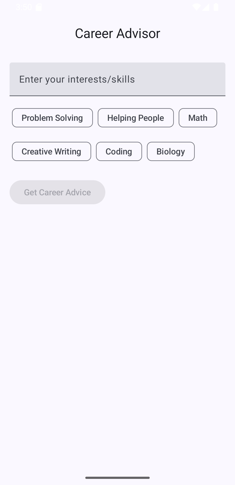
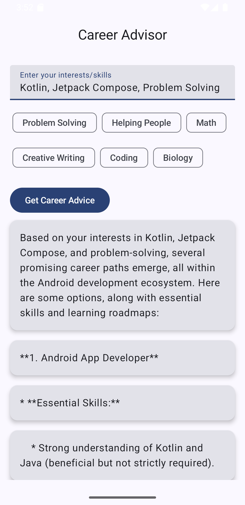

# CareerFlow - AI-Powered Career Advisor

CareerFlow is an Android app that leverages **Google Gemini 1.5 Flash** to provide real-time, personalized career advice based on your interests and skills. Whether you're exploring new career paths or refining your existing career, CareerFlow gives you AI-driven guidance and insights.

## 🚀 Powered by Google Gemini

CareerFlow uses **Gemini 1.5 Flash**, a state-of-the-art language model from Google, to deliver tailored and relevant career advice. This model is designed to understand and analyze your inputs effectively, providing practical steps and advice for your career journey.

**Model used:** `gemini-1.5-flash`  
**API integration:** [Google Generative AI SDK for Android](https://ai.google.dev/gemini-api/docs/android)

## ✨ Features

- **Personalized Career Advice**: Enter your interests or skills, and receive step-by-step advice on potential career paths.
- **Predefined Interests**: Select from a list of predefined interests (e.g., coding, math, creative writing) to get started quickly.
- **Interactive UI**: Easy-to-use interface with buttons and chips for seamless navigation and input.
- **Career Advice Timeline**: View your personalized career advice in a timeline format, breaking down your journey into actionable milestones.
- **Optimized for Android**: Native Android app built with Jetpack Compose for a modern, smooth user experience.

## 📱 Getting Started

### Prerequisites

- Android Studio (latest version)
- An active [Google Cloud account](https://cloud.google.com/)
- API key for Google Generative AI SDK (You can get it from [Google Cloud Console](https://console.cloud.google.com/))

### Setup

1. **Clone the repository**:
    ```bash
    git clone https://github.com/iNoles/CareerFlow.git
    ```

2. **Install dependencies**:
    Open the project in Android Studio and let it sync to download required dependencies.

3. **Configure API Key**:
    - Obtain your API key from [Google Cloud Console](https://console.cloud.google.com/).
    - Add the API key to your `local.properties` file:
      ```properties
      apiKey=YOUR_API_KEY
      ```

4. **Run the app**:
    - Build and run the app on your Android device or emulator.
  
## 📸 Screenshots




### Sample Usage

- Open the app and type in your interests or skills (e.g., "coding" or "problem solving").
- View the personalized career advice displayed step-by-step on your screen.
- Explore predefined interests by clicking on the available buttons to get suggestions.
- Track your career journey through a dynamic timeline of advice.

## 🔧 Built With

- **Kotlin**: Modern, expressive programming language for Android development.
- **Jetpack Compose**: The UI toolkit used for building a native Android UI.
- **Google Gemini API**: AI-powered career advice via `gemini-1.5-flash` model.

## 📦 Planned Features

- 📒 Save advice results as notes (Room DB)
- 📈 Progress tracker based on AI advice
- 🔁 Retry/resume previous sessions
- 📂 Export or share results

## 🤖 Contributing

Feel free to fork the repo and submit pull requests! Contributions, issues, and feedback are welcome.

1. Fork the repository
2. Create a new branch (`git checkout -b feature/your-feature`)
3. Commit your changes (`git commit -am 'Add your feature'`)
4. Push to the branch (`git push origin feature/your-feature`)
5. Open a pull request
